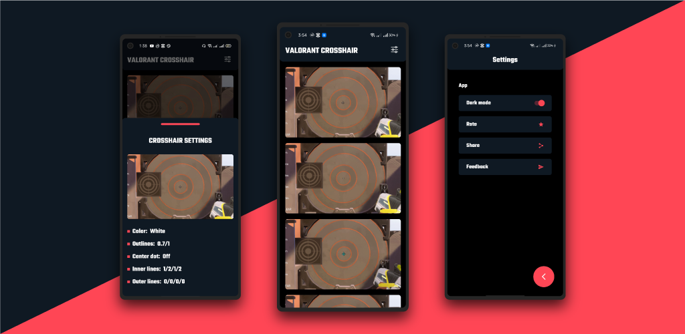
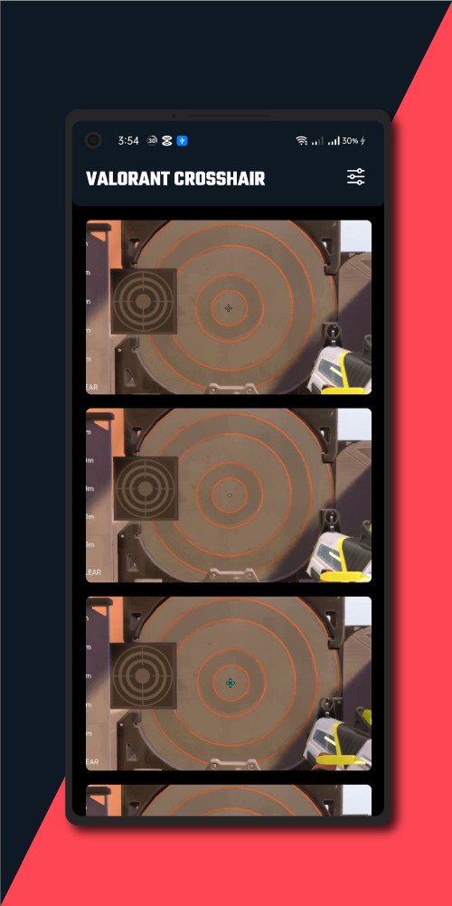
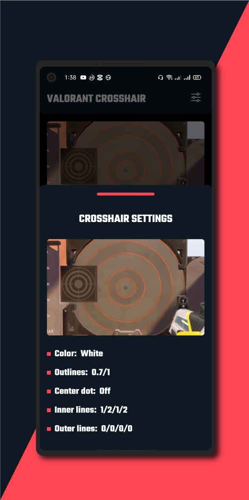

# ValorantCrosshair

 

  

## About

Valorant Crosshair is a crosshair finding application for the popular FPS game Valorant.
It provides the crosshair settings for different crosshairs of Valorant.

## Tools

- UI - XML
- Language - Java
- Database - None
- Graphics - Adobe Illustrator, Screenshots
- Version Support - Android 6 to Android 12

## White-Space

The application is live on Google Play Store.
Click on the link to download the application!  
https://play.google.com/store/apps/details?id=com.whitespace.valorant_crosshair
